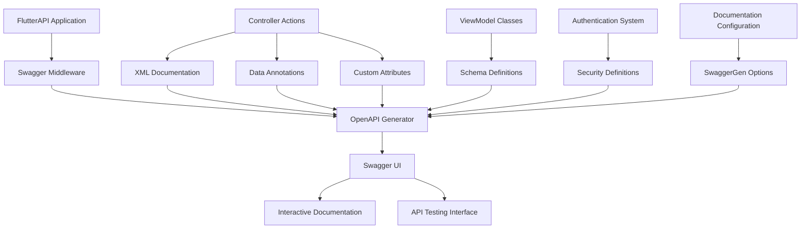

# API Documentation Design

## Overview

This design document outlines the implementation of comprehensive API documentation for the Consultation Management System's FlutterAPI project. The solution leverages Swagger/OpenAPI 3.0 with enhanced documentation attributes, custom schema configurations, and automated documentation generation to provide interactive, comprehensive API documentation.

The current API includes consultation management endpoints, dashboard functionality, authentication, and various data retrieval operations. The documentation system will enhance developer experience by providing clear, testable, and up-to-date API specifications.

## Architecture

### High-Level Architecture



### Documentation Generation Flow

1. **Code Analysis**: Swagger analyzes controller actions, parameters, and return types
2. **XML Documentation**: Extracts summary and remarks from XML comments
3. **Data Annotations**: Processes validation attributes and model metadata
4. **Custom Attributes**: Applies custom documentation attributes for enhanced descriptions
5. **Schema Generation**: Creates OpenAPI schemas for all data models
6. **UI Generation**: Renders interactive Swagger UI with all collected information

## Components and Interfaces

### 1. Swagger Configuration Component

**Purpose**: Configures Swagger/OpenAPI generation with custom settings, security definitions, and documentation enhancements.

**Key Classes**:
- `SwaggerConfiguration`: Static configuration class for Swagger setup
- `SwaggerDocumentFilter`: Custom filter for document-level modifications
- `SwaggerOperationFilter`: Custom filter for operation-level enhancements

**Configuration Features**:
- API versioning support
- Security scheme definitions
- Custom operation descriptions
- Response type documentation
- Example value generation

### 2. Documentation Attributes Component

**Purpose**: Provides custom attributes for enhanced API documentation beyond standard data annotations.

**Key Attributes**:
- `[ApiDocumentation]`: Comprehensive endpoint documentation
- `[ApiExample]`: Request/response examples
- `[ApiErrorResponse]`: Error scenario documentation
- `[ApiAuthentication]`: Authentication requirement specification

**Usage Pattern**:
```csharp
[ApiDocumentation(
    Summary = "Request a new consultation",
    Description = "Creates a consultation request between a student and faculty member",
    Tags = new[] { "Consultation" }
)]
[ApiExample(typeof(ConsultationViewModel), "Sample consultation request")]
[ApiErrorResponse(400, "Invalid request data")]
[ApiErrorResponse(404, "Student or faculty not found")]
public async Task<IActionResult> RequestConsultation([FromBody] ConsultationViewModel request)
```

### 3. Schema Documentation Component

**Purpose**: Enhances data model documentation with detailed property descriptions, validation rules, and examples.

**Implementation Strategy**:
- XML documentation comments on ViewModel properties
- Data annotation attributes for validation rules
- Custom schema filters for complex scenarios
- Example value providers for realistic test data

**Enhanced ViewModels**:
```csharp
/// <summary>
/// Represents a consultation request from a student to faculty
/// </summary>
public class ConsultationViewModel
{
    /// <summary>
    /// The full name of the student requesting consultation
    /// </summary>
    /// <example>John Doe</example>
    [Required(ErrorMessage = "Student name is required")]
    public string StudentName { get; set; }
    
    /// <summary>
    /// The date and time when the consultation is requested
    /// </summary>
    /// <example>2024-12-15T14:30:00</example>
    [Required]
    [FutureDate(ErrorMessage = "Consultation date must be in the future")]
    public DateTime DateOfConsultation { get; set; }
}
```

### 4. Authentication Documentation Component

**Purpose**: Documents authentication requirements and provides testing capabilities for protected endpoints.

**Security Schemes**:
- JWT Bearer token authentication (if implemented)
- API key authentication (if applicable)
- Session-based authentication documentation

**Implementation**:
- Security requirement definitions in Swagger configuration
- Authentication flow documentation
- Token format and usage examples
- Error response documentation for authentication failures

### 5. Error Response Documentation Component

**Purpose**: Standardizes and documents all possible error responses across the API.

**Standard Error Response Model**:
```csharp
/// <summary>
/// Standard error response format
/// </summary>
public class ApiErrorResponse
{
    /// <summary>
    /// Error message describing what went wrong
    /// </summary>
    public string Message { get; set; }
    
    /// <summary>
    /// Detailed error information for debugging
    /// </summary>
    public string Error { get; set; }
    
    /// <summary>
    /// Field-specific validation errors
    /// </summary>
    public Dictionary<string, string[]> ValidationErrors { get; set; }
}
```

### 6. Interactive Testing Component

**Purpose**: Enables direct API testing through Swagger UI with proper request/response handling.

**Features**:
- Parameter input forms
- Request body editors with syntax highlighting
- Response display with formatting
- Authentication token input
- Request history and bookmarking

## Data Models

### Enhanced ViewModel Documentation

All existing ViewModels will be enhanced with comprehensive documentation:

#### ConsultationViewModel
- Purpose: Request consultation between student and faculty
- Required fields: StudentName, FacultyName, CourseCode, Concern, DateOfConsultation
- Validation rules: Future date validation, required field validation
- Example values: Realistic test data for all properties

#### DashboardViewModel
- Purpose: Student dashboard data display
- Nested objects: Student information, consultation statistics
- Collections: Notification list with status updates
- Computed fields: School year formatting, pending consultation counts

#### RequestViewModel
- Purpose: Student course and school year information
- Nested collections: Course information with instructor details
- Formatting: School year and semester display logic

### Error Response Models

Standardized error response formats for consistent error handling:

#### ValidationErrorResponse
- Field-level validation errors
- Error message formatting
- HTTP status code mapping

#### BusinessLogicErrorResponse
- Domain-specific error scenarios
- User-friendly error messages
- Error code classification

## Error Handling

### Documentation Error Scenarios

#### 400 Bad Request
- Invalid model state
- Missing required fields
- Invalid date formats
- Business rule violations

#### 404 Not Found
- Student not found
- Faculty not found
- Consultation request not found
- Resource does not exist

#### 500 Internal Server Error
- Database connection failures
- Unexpected system errors
- Third-party service failures

### Error Response Documentation

Each endpoint will document:
- All possible HTTP status codes
- Error response body format
- Common error scenarios
- Troubleshooting guidance

## Testing Strategy

### Documentation Testing

#### Automated Tests
- Swagger document generation validation
- Schema validation against actual responses
- Documentation completeness checks
- Example value validation

#### Manual Testing
- Interactive testing through Swagger UI
- Documentation accuracy verification
- User experience testing
- Cross-browser compatibility

### Integration with Existing Tests

#### Test Data Integration
- Use existing test builders for example generation
- Leverage test fixtures for realistic data
- Integrate with test database for live examples

#### Continuous Integration
- Documentation generation in build pipeline
- Automated documentation deployment
- Version-specific documentation publishing

## Implementation Phases

### Phase 1: Basic Swagger Enhancement
1. Configure enhanced Swagger generation
2. Add XML documentation to existing controllers
3. Implement basic custom attributes
4. Set up development environment access

### Phase 2: Comprehensive Model Documentation
1. Enhance all ViewModel classes with documentation
2. Implement schema filters for complex scenarios
3. Add validation rule documentation
4. Create example value providers

### Phase 3: Authentication and Security
1. Document authentication requirements
2. Implement security scheme definitions
3. Add authentication testing capabilities
4. Document protected endpoint access

### Phase 4: Error Handling and Testing
1. Standardize error response formats
2. Document all error scenarios
3. Implement interactive testing enhancements
4. Add automated documentation validation

### Phase 5: Advanced Features
1. API versioning documentation
2. Rate limiting documentation
3. Performance considerations
4. Deployment and maintenance automation

## Configuration Management

### Environment-Specific Settings

#### Development Environment
- Full Swagger UI access
- Detailed error information
- Interactive testing enabled
- Debug information included

#### Production Environment
- Configurable Swagger access
- Sanitized error responses
- Security-conscious documentation
- Performance-optimized generation

### Documentation Maintenance

#### Automated Updates
- Code change detection
- Documentation regeneration
- Version control integration
- Deployment pipeline integration

#### Quality Assurance
- Documentation review process
- Accuracy validation
- User feedback integration
- Continuous improvement cycle